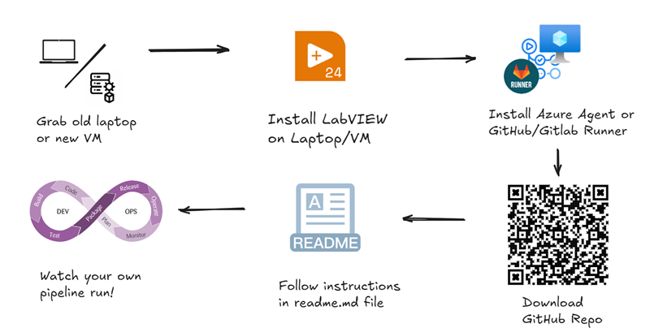
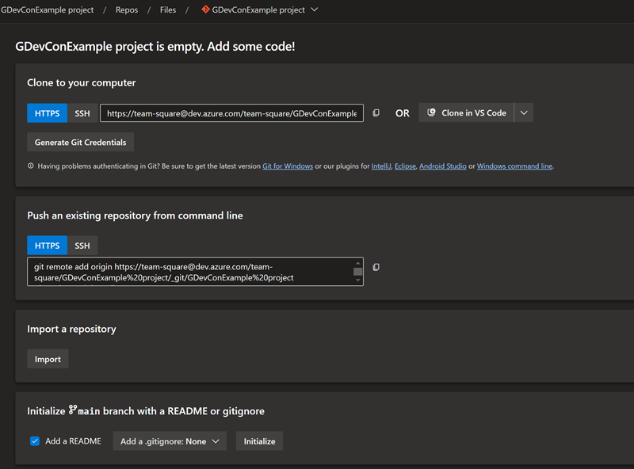
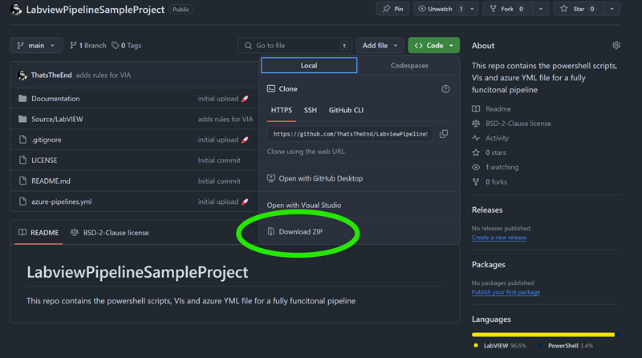

# LabviewPipelineSampleProject
This repo contains the powershell scripts, VIs and azure YML file for a fully funcitonal pipeline on Azure DevOps.

## TL:DR
This is an overview how this repo should help you along:



- Grab an old laptop / VM
- Install LabVIEW on it
- Install the Azure DevOps agent / GitLab Runner / GitHub Runner / etc… on it
- Head to this repo and download the code 
- Apply the VIPC file (for Caraya and G-CLI)
- (If not using Azure DevOps, throw the azure-pieline.yml into ChatGPT and convert it to instructions readable for your platform)
- Adapt some variables according to the instructions in the readme.md and install a VIPC with Caraya and G-Cli
- Run the powershell scripts on your machine for each step
- Push all of it to your repo
- Watch your first full pipeline run

## Pitfals
Things to watch out for while working on your Azure DevOps project:

- Access to pipeline runner is a must
- Agree on a project template (disk folder structure and LabVIEW project)
- Start small
- Use semantic versioning for commits (e.g. `0.9.1`)
- Take care of failing pipelines, broken pipelines are a sign to your team that it's okay to push code that is not good enough.

## Detailed Instructions


This example works best when you are coming from an empty Azure DevOps repo.

1. Create a new repo in your Azure project and clone it to your pc



2. Download the code from this repo and unzip into the newly created Azure Repo



3. Open VIPM and install the following packages on your machine and on your agent/runner:
    - [Caraya](https://www.vipm.io/package/jki_lib_caraya/)
    - [G CLI](https://www.vipm.io/package/wiresmith_technology_lib_g_cli/)
    - [VIA Checkstyle](Source/LabVIEW/CICD/VIs/ni_lib_via_checkstyle-1.0.1.4.vip)
    - [DQMH](https://www.vipm.io/package/delacor_lib_dqmh_toolkit/)

4. Open the LabVIEW project at `root\Source\LabVIEW\pipelineExampleProject.lvproj`. It should open without any errors or dependencies missing.

5. Connect the agent to your azure instance, [the instructions can be found here](https://learn.microsoft.com/en-us/azure/devops/pipelines/agents/windows-agent?view=azure-devops). I would strongly recommend to use an interactive agent, not a service. This will enable to see all ativity that happens on your agent.

6. Open a powershell console at the location of `root\Source\LabVIEW\CICD`. Open the scripts and inspect them one by one for their functionality. Run: 

```powershell
.\openProject.ps1
```
This will open the project for you. If you had it already open, close the project and try again.

7. Run the unit tests:

```powershell
.\.\runUnitTests.ps1
```
THis will create a unit test results file.

9. Run the VI Analyzer for your code.

